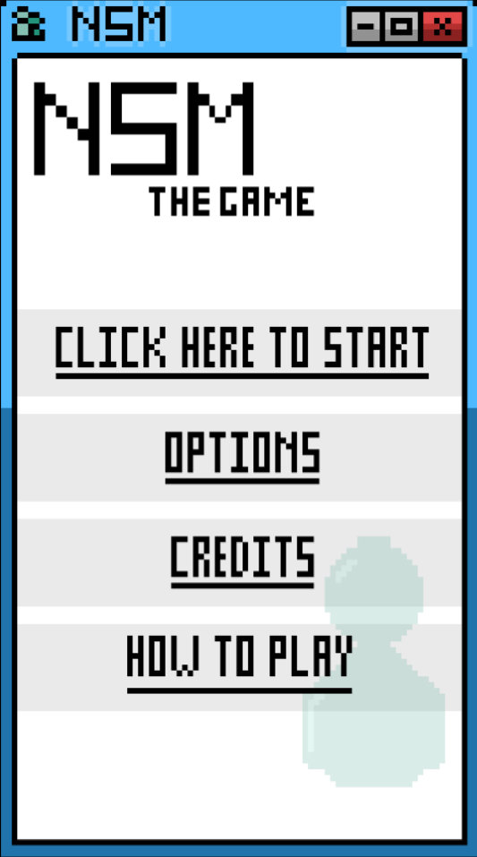
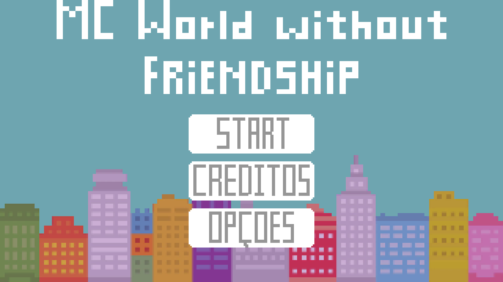
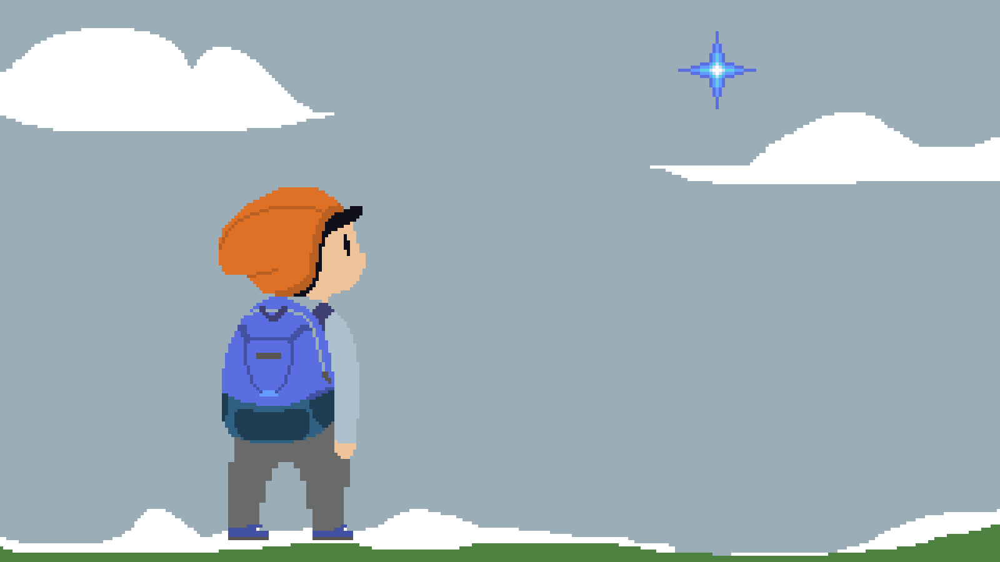

## SOBRE MIM

Gabriel Galvão de Medeiros, 18.

Aluno do curso de programação de jogos digitais.

Hater de Biologia.

Amante de preguiças.

# Jogos

[**NSM**](https://lemuelmarques.github.io/NSMTHEGAME/)

[**MC World Without Friendship**](https://ronaque.github.io/MCWWF/)

[**The last human**](https://galva1.github.io/LH/)

# Prêmios
Menção honrosa no jogo NSM, 1 bimestre da matéria técnica _oficina_.

Criatividade no jogo MCWWF, 2 bimestre da matéria técnica _oficina_.

Melhor arte no jogo The last human, 3 bimestre da matéria técnica _oficina_.

<a href=""> IMAGEM OU TEXTO </a>

# Artes

## Contatos

- Github: [https://github.com/Galva1](https://github.com/Galva1)
